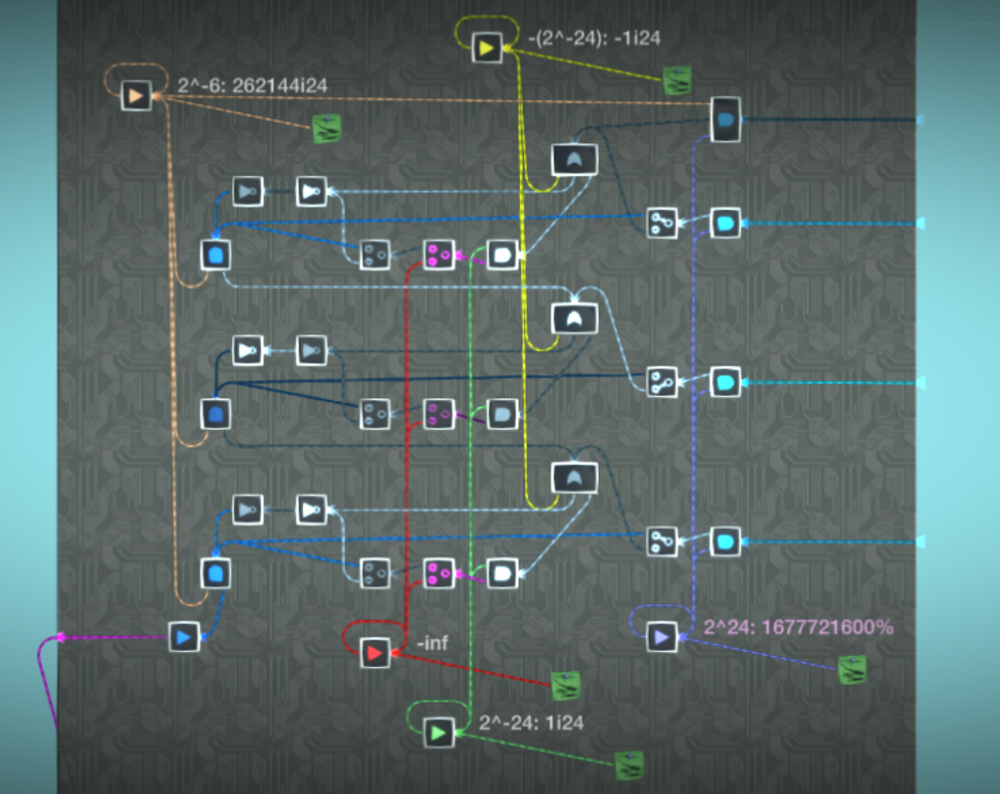

# Analog conversions

## Digital to analog combiner/encoder

Up to 24 bits can be encoded into a single analog value using a digital to analog combiner circuit as shown. This version does 4 bits:

Repeat the pattern for as many bits as needed. The orange battery is 50%. Note that the input bits are interpreted as being on if they have an analog value of 100% and off if it is 0%. Their digital value is not relevant.

## Pure analog splitter/decoder

The following circuit can be used to split an analog value back into 24-bit (or fewer) bits. This is a version for only 3 bits but it can be extended:

Like with the combiner, the digital output is irrelevant. Only the analog value of the outputs matter. These will always be `0%` or `100%`.

Here is a graphic explaining how it works:

## Basic analog to digital splitter/decoder

 TODO

## Holy Cow converter

_Credit to @spagtwo for this invention._

Using a direction combiner in angleify mode, it is possible to split up to a 24-bit analog signal into digital using only 2 gates per bit. That means for a full 24-bit analog signal, only 48 gates (plus some batteries) are needed to extract the signal to digital again. This requires a [signal with a `-inf` value](/wiki/game-mechanics/gate-behavior/README.md#inf-nan-and-illegal-values).

In the following image, the OR gates are in add mode and the direction combiners are in angleify mode with `-inf` in their bottom inputs.

It's called the Holy Cow converter because that was the reaction when it was discovered.

## Greater than 24-bit splitter/decoder

 TODO

## Analog bitshifting

Analog values are limited to 24 bits of precision and will round when necessary. This behavior can be exploited to efficiently bitshift values without needing to extract their individual bits.

For example, suppose you have the 24-bit value `0xabcdef` (`~67.11%`). Multiply this in an AND gate with a value of 2-8 (`0.390625%`) and it will be lowered to `0x00abcd.ef`. Pass this through a NOT gate twice, which performs `100% - (100% - x)`, and the bits after the decimal point will be lost, giving `0x00abce.00`. Multiply by 28 to get back to the original magnitude.

|                               | Hex               | Binary                                                    | Percentage |
| ----------------------------- | ----------------- | --------------------------------------------------------- | ---------- |
| Before multiplication         | `0xabcdef.000000` | `0b10101011_11001101_11101111.00000000_00000000_00000000` | ~`67.1111%`  |
| Multiply by 2-8    | `0x00abcd.ef0000` | `0b00000000_10101011_11001101.11101111_00000000_00000000` | ~`0.2622%`   |
| First NOT (without rounding) | `0xff5432.110000` | `0b11111111_01010100_00110010.00010001_00000000_00000000` | ~`99.7378%`  |
| First NOT (with rounding) | `0xff5432.000000` | `0b11111111_01010100_00110011.00000000_00000000_00000000` | ~`99.7378%`  |
| Second NOT | `0x00abce.000000` | `0b00000000_10101011_11001110.00000000_00000000_00000000` | ~`0.2622%`  |
| Multiply by 28    | `0xabce00.000000` | `0b10101011_11001110_00000000.00000000_00000000_00000000` | ~`61.1112%`   |

Note that multiplying by 28 requires using [analog values >100%](/wiki/game-mechanics/gate-behavior/README.md#inf-nan-and-illegal-values).

The resulting value, `0xabce00`,is larger than the expected value of `0xabcd00` because it was rounded up. This rounding can be detected by comparing the new value with the original. If the new value is greater, rounding occurred, otherwise, no rounding occurred. We can subtract 2-16 if rounding occurred to get back to the original value: `0xabce00 - 0x000100 = 0xabcd00`.

To get the lower 8 bits of the original value, subtract the new value from the original and multiply the result by 216: `(0xabcdef - 0xabcd00) << 16 = 0xef0000`.

In this example `n=8`, but it can be generalized to split any 24-bit value into its lower `n` bits and its upper `24-n` bits. The general algorithm is as follows:

* To split a 24-bit value `x` into its lower `n` bits `l` and the remaining high bits `h`:
* `a = x * 2^-n`
* `b = NOT(NOT(a))`
* `c = b * 2^n`
* if `c > x`, then `h = c - 2^(n - 24)`, else `h = c`
* `d = x - h`
* `l = d * (24 - n)`

For a circuit that can bitshift analog values both left and right by any amount, not just a fixed value, see [arbitrary bitshifting](/wiki/computing-components/analog-integer-arithmetic/README.md#arbitrary-bitshifting).

### 24-bit to 4x6-bit splitter

The following is an optimized application of the above for splitting a single 24-bit analog value into four 6-bit values:

The pink direction combiners are in angleify mode.
