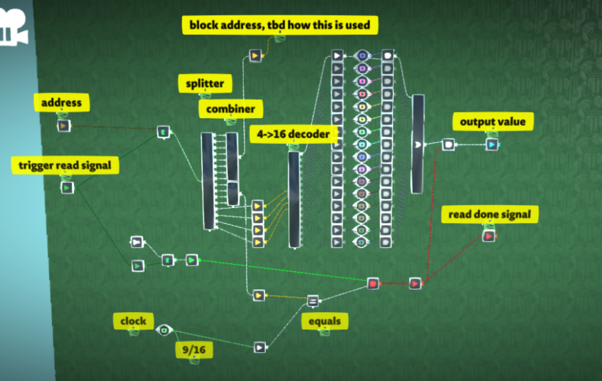
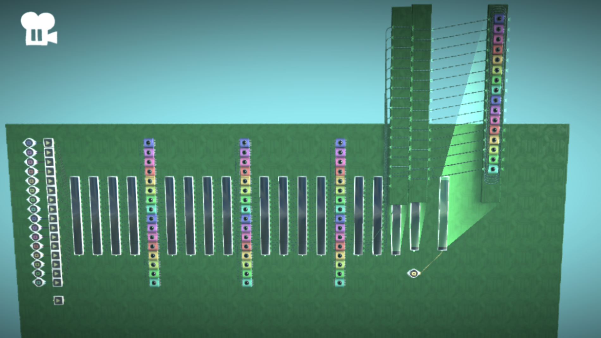

# Loop memory

100kB of memory in a single level baby 😎

### Loop core

TODO: Fix videos

Normally when microchips are connected together directly, values pass through them instantly:
[video](loop1.mov)

But if you wire at least one input from each microchip in the series into the microchip that comes before it, then a delay is introduced. Here, each microchip output is connected to a red gate in the microchip to the left of it:
[video](loop2.mov)

**Important:** all the gates and microchips _must_ be created in the order of left-to-right, otherwise the delay won't work. If sections of your loop are instant when they should have a delay, try re-placing everything in the correct order. What matters is the creation order. Moving or re-wiring gates doesn't affect this.

You can then connect the final microchip in a loop back to the first microchip, creating an endless cycle where signal values will be trapped.
[video](loop3.mov)

It is technically possible to close the loop directly with wires as above, but I **strongly recommend** using tags as shown below instead:
[video](loop4.mov)

The reason for this is that it allows much easier reading and writing of the values. The placement order requirement extends to all gates that are connected in any way to the loop, so creating connections at the start and the end of your loop for reading/writing can easily break it and it's very hard to debug and fix. Tags fix this by completely isolating the circuit so that you don't need to worry about placement order anymore.
Instead of having a single data value passing through each microchip, you can have multiple. Only one connection is needed from each microchip into the red gate of the previous microchip. Color or label the tags differently so that they don't interfere:
[video](loop5.mov)

Finally, it is possible to remove all of the relay gates and connect microchips to each other directly. You can remove the microchip stickers too:
[video](loop6.mov)

A memory loop is defined by two characteristics: the number of values per microchip, and the number of microchips per loop. In this example there are 3 values per microchip and 7 microchips per loop.
Each value per microchip consumes about 10 thermometer points, while each microchip (including its connection back to the previous microchip) consumes about 65 thermometer points. Each tag/tag sensor pair consumes about 40 thermometer points.
The more values per microchip, the more efficient the memory. I usually use 16 values per microchip.
The more microchips per loop, the more efficient the design as well, but also the higher the latency for writing. In this example, it may take up to 7 frames to write a value to the loop because you need to wait for it to cycle around to the correct position.

## Reading

TODO

## Writing

TODO

## Cache-based access

TODO

## Center tag optimization 

TODO

